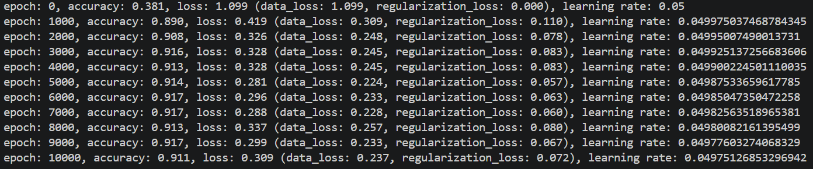
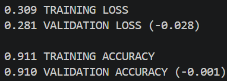

# NeuralScratchwork
An artificial neural network developed with raw Python and NumPy only.

---

## Table of Contents
- [About the project](#about-the-project)
- [Status Quo](#status-quo)
- [Whats's next?](#whats-next)

## About the project
NeuralScratchwork is one of three simple neural networks created for classification exercises. Each is coded using a different set of frameworks:

- [NeuralScratchwork](https://github.com/Yaaramir/NeuralScratchwork): This network is created with raw Python and only implements NumPy to organize and utilize data in arrays. This repository dictates the speed and content of the other two, as it serves as the template for both.
- [NeuralTorchwork](https://github.com/Yaaramir/NeuralTorchwork): Based on NeuralScratchwork this project makes use of the [PyTorch framework](https://pytorch.org/) developed by Meta's AI Research lab.
- [NeuralFlowwork](https://github.com/Yaaramir/NeuralFlowwork): Based on NeuralScratchwork this project makes use of the [TensorFlow framework](https://www.tensorflow.org/) developed by Alphabet Inc.'s Google Brain Team.

The primary goal is to implement a complete network from scratch in ***NeuralScratchwork*** that can be trained and used for simple classification exercises, while simultaneously implementing the PyTorch and TensorFlow solutions.

Once that stage is completed, ***NeuralTorchwork*** will be further developed for deployment within the OpenFlexure project, while ***NeuralFlowwork*** will be transformed for use in an office and smart home scenario.

Since understanding the core mechanics of neural networks and learning how to use them successfully is the main goal of this project, development does not necessarily follow the fastest or most efficient path. Instead, it often takes detours to fully capture the edges, boundaries, challenges, and opportunities that these frameworks and their underlying paradigms offer.

Idea and architecture of the ***NeuralScratchwork*** are conceived and inspired by [Neural Networks from Scratch](https://nnfs.io/) (Kinsley H., Kukiela D., 2020).

## Status Quo
### Model:
- 2 hidden linear dense layers with ReLU
- 1 output dense layer with Softmax
- CCE for loss calculation
- Adam optimizer with L2 regularization

### Data:
A training dataset of spiraling points in a 2D space with 1,000 samples and 3 classes is created, using the nnfs.io dataset library.

### Training:
The network trains for 10k epochs by performing forward passes, backward passes, gradient calculation, and parameter updating.

A validation dataset is used to evaluate model performance while tuning hyperparameters.

### Evaluation
- Accuracy and loss reach acceptable values at this state of development. Convergence is achieved fast, regularization works as intended. An increase in accuracy (and decrease in loss) is to be expected with further implementations.
- The small differences between training and validation results indicate a very high degree of generalization and no overfitting.

## What's next?
Next step will be to implement a dropout layer to further stabilize the network. Afterwards other output layers and regression will be considered, beore the network will be opened for other and unknown types of data. Ultimately, a generalized approach to handle various types of datasets with different number of classes will be aimed for.
___

[_Jump back to the top_](#neuralscratchwork)
