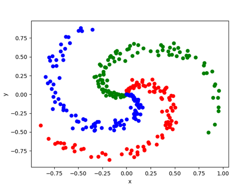
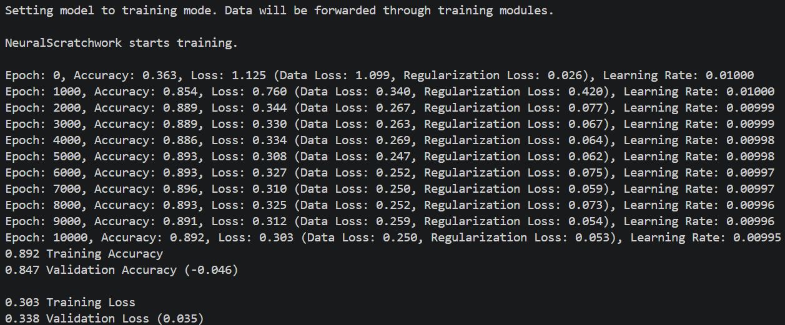

# NeuralScratchwork
NeuralScratchwork is a framework for creating and making use of Artificial Neural Networks developed in raw Python with NumPy.

---

## Table of Contents
- [About the project](#about-the-project)
- [Status Quo](#status-quo)
- [Whats's next?](#whats-next)

## About the project
***NeuralScratchwork*** is a modular framework for building and experimenting with neural networks developed completely from scratch. Built using raw Python and NumPy for high-level array manipulation, this framework is designed to provide absolute freedom when modifying, tuning, and re-architecting every single element of a neural network's topology.

While mainstream frameworks like PyTorch or TensorFlow prioritize production-grade efficiency, ***NeuralScratchwork’s*** primary goal is to make the inner mechanics of network modules, hyperparameter tuning, and core algorithmic components accessible at a mathematical and computer-science level.

The project was inspired by Neural Networks from Scratch (Kinsley H., Kukiela D., 2020). Coding a simple Fully Connected Network (FCN) from scratch revealed the vast design space available when shaping individual components, modules, and functions—and how directly these choices impact machine learning performance.

Continuous experimentation, the integration of cutting-edge ideas or niche solutions, and the flexible combination of various architectures are vital for deep learning intuition. ***NeuralScratchwork*** serves as a dedicated research and experimentation platform, empowering developers to pit different architectural approaches against each other, compare their behaviors, and push the boundaries of custom deep learning design.

## Status Quo
### Framework:

__Available modules__
- Layers
  - Dense Layers
  - Dropout Layers
- Activation Functions
  - Rectified Linear Unit (ReLU)
  - Softmax
  - Sigmoid
- Loss Functions
  - Binary Cross Entropy (BCE)
  - Categorical Cross Entropy (CCE)
- Optimizers
  - Adaptive Gradient (Adagrad)
  - Adaptive Moment Estimation (Adam)
  - Root Mean Square Propagation (RMSprop)
  - Stochastic Gradient Descent (SGD)

__Available presets__
- Fully Connected Network (FCN)

### Data:
Datasets for different scenarios will be implemented and ready to use to test new architectures fast and effortless. At this point of development, a external Dataset (spiral data by nnfs.io) is implemented for testing.

### Testing:
The Fully Connected Network (FCN) has been put into testing, loading a dataset from nnfs.io and feeding it data. The network trains for a 10,000 epochs by performing forward passes, backward passes, gradient calculation, and parameter updating. A validation dataset is used to evaluate model performance while tuning hyperparameters.

### Evaluation
- The results indicate strong generalization, with training and validation loss metrics matching closely within a negligible margin. The validation accuracy scores only 0.01 percentage points lower than training accuracy, but a hihgher score (due to the missing droput while validating) would be expected. This could still indicate a small amount of overfitting.
- Both L1, L2 regularization and dropout have been shown to serve their purpose well by preventing overfitting and co-adaptation up to a high degree.
- An accuracy of ~90% and a loss of ~0.29 represent strong baseline results, which can likely be improved further through continued hyperparameter tuning and architecture reconsiderations.

## What's next?
- Data preprocessing will be implemented to open the framework for various kinds of datasets.
- A GUI will be implemented to create a model, tune its hyperparameters, train and use it.
- While new modules will be implemented constantly, Binary Regression will be the next output layer to be added.

Have a look at this project's [Issues](https://github.com/Yaaramir/NeuralScratchwork/issues) as well to see imminent enhancements and bug fixes.
___

[_Jump back to the top_](#neuralscratchwork)
