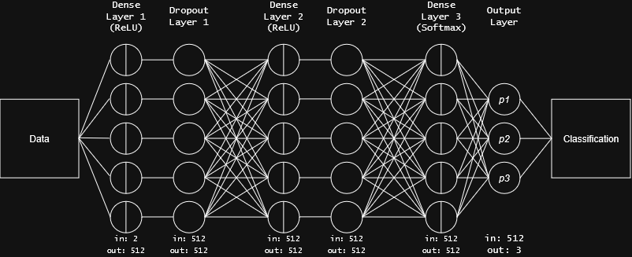

# NeuralScratchwork
NeuralScratchwork is a framework for creating and making use of Artificial Neural Networks developed in raw Python with NumPy.

---

## Table of Contents
- [About the project](#about-the-project)
- [Status Quo](#status-quo)
- [Whats's next?](#whats-next)

## About the project
NeuralScratchwork is one of three simple neural networks created for classification exercises. Each is coded using a different set of frameworks:

- [NeuralScratchwork](https://github.com/Yaaramir/NeuralScratchwork): This network is created with raw Python and only implements NumPy to organize and utilize data in arrays. This repository dictates the speed and content of the other two, as it serves as the template for both.
- [NeuralTorchwork](https://github.com/Yaaramir/NeuralTorchwork): Based on NeuralScratchwork this project makes use of the [PyTorch framework](https://pytorch.org/) developed by Meta's AI Research lab.
- [NeuralFlowwork](https://github.com/Yaaramir/NeuralFlowwork): Based on NeuralScratchwork this project makes use of the [TensorFlow framework](https://www.tensorflow.org/) developed by Alphabet Inc.'s Google Brain Team.

The primary goal is to implement a complete network from scratch in ***NeuralScratchwork*** that can be trained and used for simple classification exercises, while simultaneously implementing the PyTorch and TensorFlow solutions in ***NeuralTorchwork*** and ***NeuralFlowwork***.

Once that stage is completed, the projects will evolve further:
-  ***NeuralScratchwork*** is developed as a raw framework that allows for every kind of tuning: mathematical functions, hyperparameters, architecture, and topology. Since no external libraries other than NumPy have been used, this framework can be adjusted directly in its core elements, such as loss, activation, or optimization modules. New modules will be added frequently and latest developments will be implemented.
-  ***NeuralTorchwork*** will be further developed for deployment within the OpenFlexure Project to serve as a scientific data classifier for open-source microscopy and telescopy applications, making use of and helping improve or enlarge public databases.
-  ***NeuralFlowwork*** will be transformed for use in an office and smart home scenario.

The primary goal of NeuralScratchwork is the development of an easy to change and to experiment with framework to implement changes fast and directly, giving more freedom to users and developers than frameworks that are concentrating on error avoidance and security.

The ***NeuralScratchwork*** was inspired by [Neural Networks from Scratch](https://nnfs.io/) (Kinsley H., Kukiela D., 2020).

## Status Quo
### Framework:

__Available modules__
- Layers
  - Dense Layers
  - Dropout Layers
- Activation Functions
  - Rectified Linear Unit (ReLU)
  - Softmax
- Loss Functions
  - Categorical Cross Entropy (CCE)
- Optimizers
  - Stochastic Gradient Descent (SGD)
  - Adaptive Gradient (Adagrad)
  - Root Mean Square Propagation (RMSprop)
  - Adaptive Moment Estimation (Adam)

### Data:
So far only one dataset (Spiral Data, labeled and with dynamic number of samples and classes) is implemented. For testing the implementations, training and validation datasets are created and the results are evaluated.

### Training:
The network trains for a 10,000 epochs by performing forward passes, backward passes, gradient calculation, and parameter updating. A validation dataset is used to evaluate model performance while tuning hyperparameters.

### Evaluation
- The results indicate strong generalization, with training and validation loss metrics matching closely within a negligible margin. The validation accuracy scores only 0.01 percentage points lower than training accuracy, but a hihgher score (due to the missing droput while validating) would be expected. This could still indicate a small amount of overfitting.
- Both L1, L2 regularization and dropout have been shown to serve their purpose well by preventing overfitting and co-adaptation up to a high degree.
- An accuracy of ~90% and a loss of ~0.29 represent strong baseline results, which can likely be improved further through continued hyperparameter tuning and architecture reconsiderations.

## What's next?
- Data preprocessing will be implemented to open the framework for various kinds of datasets.
- A GUI will be implemented to create a model, tune its hyperparameters, train and use it.
- While new modules will be implemented constantly, Binary Regression will be the next output layer to be added.

Have a look at this project's [Issues](https://github.com/Yaaramir/NeuralScratchwork/issues) as well to see imminent enhancements and bug fixes.
___

[_Jump back to the top_](#neuralscratchwork)
