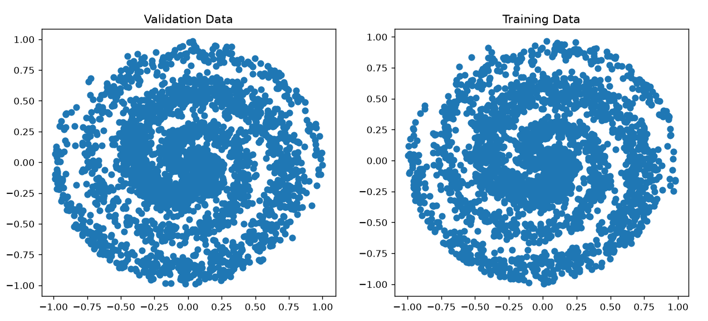
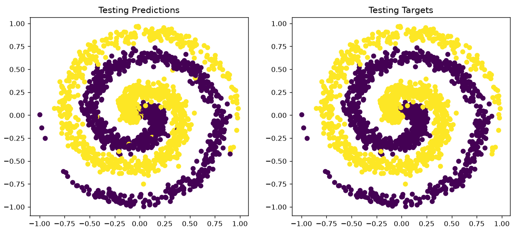

# NeuralScratchwork
***NeuralScratchwork*** is an experimental playground built to benchmark, combine, and dissect custom neural network architectures from the mathematical ground up using raw Python.

[](https://github.com/Yaaramir/NeuralScratchwork/actions/workflows/pytest.yml)

---

## Table of Contents
- [About the project](#about-the-project)
- [Status Quo](#status-quo)
- [Whats's next?](#whats-next)

## About the project
***NeuralScratchwork*** is a modular framework for building and experimenting with neural networks developed completely from scratch. Built using raw Python and NumPy for high-level array manipulation, this framework is designed to provide absolute freedom when modifying, tuning, and re-architecting every single element of a neural network's topology.

While mainstream frameworks like PyTorch or TensorFlow prioritize production-grade efficiency, ***NeuralScratchwork’s*** primary goal is to make the inner mechanics of network modules, hyperparameter tuning, and core algorithmic components accessible at a mathematical and computer-science level.

The project was inspired by Neural Networks from Scratch (Kinsley H., Kukiela D., 2020). Coding a simple Fully Connected Network (FCN) from scratch revealed the vast design space available when shaping individual components, modules, and functions—and how directly these choices impact machine learning performance.

Continuous experimentation, the integration of cutting-edge ideas or niche solutions, and the flexible combination of various architectures are vital for deep learning intuition. ***NeuralScratchwork*** serves as a dedicated research and experimentation platform, empowering developers to pit different architectural approaches against each other, compare their behaviors, and push the boundaries of custom deep learning design.

## Status Quo
### The Framework so far:


__Available features__ *(click on a module to open list of implementations)*
<details>
<summary>Layers</summary>

  - Dense Layers
  - Dropout Layers

</details>
<details>
<summary>Activation Functions</summary>

  - Linear
  - Rectified Linear Unit (ReLU)
  - Softmax
  - Sigmoid

</details>
<details>
<summary>Loss Functions</summary>

  - Binary Cross Entropy (BCE)
  - Categorical Cross Entropy (CCE)
  - Mean Absolute Error (MAE)
  - Mean Squared Error (MSE)
</details>
<details>
<summary>Optimizers</summary>

  - Adaptive Gradient (Adagrad)
  - Adaptive Moment Estimation (Adam)
  - Root Mean Square Propagation (RMSprop)
  - Stochastic Gradient Descent (SGD)
  
</details>
<details>
<summary>Presets</summary>

  - Fully Connected Network (FCN) for simple classification
  - Fully Connected Network (FCN) for binary regression

</details>

### Usage

Users can create custom networks by creating modules. This is how a FCN for simple classification tasks could look like:
```python
import neuralscratchwork as scratch

# Create modules
dense_1 = scratch.Layer_Dense(2, 512, weight_regularizer_l2=1e-3, bias_regularizer_l2=1e-3)
activation_1 = scratch.Activation_ReLu()
dropout_1 = scratch.Layer_Dropout(0.1)
dense_2 = scratch.Layer_Dense(512, 512, weight_regularizer_l2=1e-3, bias_regularizer_l2=1e-3 )
activation_2 = scratch.Activation_ReLu()
dropout_2 = scratch.Layer_Dropout(0.1)
dense_3 = scratch.Layer_Dense(512, n_classes)
cce = scratch.Loss_CategoricalCrossEntropy()
adam = scratch.Optimizer_Adam()
```
A dataset is then fowarded through the network:
```python
# Forward Pass
dense_1.forward(X_train)
activation_1.forward(dense_1.output)
dropout_1.forward(activation_1.output)
dense_2.forward(dropout_1.output)
activation_2.forward(dense_2.output)
dropout_2.forward(activation_2.output)
dense_3.forward(dropout_2.output)
data_loss = cce.data_loss(dense_3.output, y_train)
reg_loss = cce.regularization_loss(dense_1) + cce.regularization_loss(dense_2) + cce.regularization_loss(dense_3)
loss_train = data_loss + reg_loss
```
The same happens for backpropagation:
```python
# Backward Pass
cce.backward(cce.predictions, y_train)
dense_3.backward(cce.dinputs)
dropout_2.backward(dense_3.dinputs)
activation_2.backward(dropout_2.dinputs)
dense_2.backward(activation_2.dinputs)
dropout_1.backward(dense_2.dinputs)
activation_1.backward(dropout_1.dinputs)
dense_1.backward(activation_1.dinputs)
```
The optimizer is put to work to update parameters for a new forward pass.
```python
# Optimizing
adam.pre_update_params()
adam.update_params(dense_1)
adam.update_params(dense_2)
adam.update_params(dense_3)
adam.post_update_params()
```
Already created and tuned networks can be loaded and run as presets:
```python
# FCN for classification tasks
model_1 = scratch.FCN_Classification()
model_1.run()
```
Data plots, training progress and validation evaluation are displayed:



*(Pre-training data plots)*

```
epoch: 0, acc: 0.305, loss: 1.125 (data_loss: 1.099, reg_loss: 0.026), lr: 0.010000)
epoch: 100, acc: 0.836, loss: 0.596 (data_loss: 0.448, reg_loss: 0.148), lr: 0.010000)
epoch: 200, acc: 0.883, loss: 0.452 (data_loss: 0.310, reg_loss: 0.142), lr: 0.009999)
epoch: 300, acc: 0.894, loss: 0.403 (data_loss: 0.277, reg_loss: 0.127), lr: 0.009999)
epoch: 400, acc: 0.885, loss: 0.405 (data_loss: 0.286, reg_loss: 0.118), lr: 0.009998)
epoch: 500, acc: 0.894, loss: 0.388 (data_loss: 0.273, reg_loss: 0.115), lr: 0.009998)
...
epoch: 9500, acc: 0.906, loss: 0.304 (data_loss: 0.241, reg_loss: 0.063), lr: 0.009953)
epoch: 9600, acc: 0.903, loss: 0.299 (data_loss: 0.236, reg_loss: 0.063), lr: 0.009952)
epoch: 9700, acc: 0.906, loss: 0.301 (data_loss: 0.241, reg_loss: 0.060), lr: 0.009952)
epoch: 9800, acc: 0.904, loss: 0.315 (data_loss: 0.238, reg_loss: 0.077), lr: 0.009951)
epoch: 9900, acc: 0.897, loss: 0.310 (data_loss: 0.244, reg_loss: 0.066), lr: 0.009951)
epoch: 10000, acc: 0.910, loss: 0.298 (data_loss: 0.238, reg_loss: 0.060), lr: 0.009950)

0.910 Training Accuracy
0.881 Validation Accuracy (-0.029)

0.298 Training Loss
0.354 Validation Loss (0.055)
```
*(evaluation data)*



*(Post-training data plots)*


## What's next?
- **Data preprocessing** will be implemented to open the framework for various kinds of datasets.
- **Standard datasets** will be integrated to acquire training, testing, and validation data quickly and effortlessly.
- A **research toolkit** — including a GUI — will follow to compare different architectures and topologies, enabling seamless experimentation with neural networks.
- **Model presets** for various best-practice architectures will be integrated for out-of-the-box usage and easy benchmarking.
- **Convolutional modules** will be added next to process image data, as new layers and components are continuously developed.

Have a look at this project's [**Issues**](https://github.com/Yaaramir/NeuralScratchwork/issues) as well to see imminent enhancements and bug fixes.
___

[_Jump back to the top_](#neuralscratchwork)